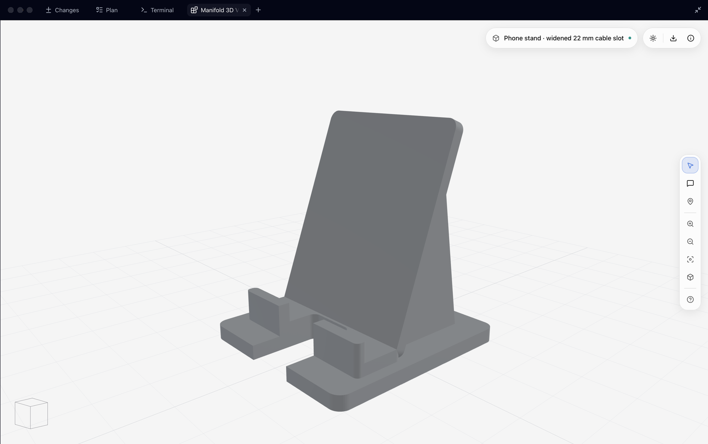

# Manifold 3D — AI 3D modeling for 3D printing

[English](README.md) | [简体中文](README.zh-CN.md)

[](LICENSE)

[](https://deepwiki.com/zhicwan/manifold3d-mcp)

**Describe a part. Refine it in 3D. Export STL for your slicer.**

Manifold 3D brings AI 3D modeling to GitHub Copilot and Claude Code. Your assistant
writes parametric TypeScript, validates the geometry, and opens an interactive
preview. Use it for code-driven parametric CAD and 3D printing projects, from
phone stands and organizers to keycaps and terrain models.

## From prompt to model

[](docs/usage.md#example-widen-a-cable-slot)

_Phone stand in Copilot Canvas, with the cable slot widened to 22 mm.
[Compare the 14 mm and 22 mm slots and reproduce the model](docs/usage.md#example-widen-a-cable-slot)._

[View the parametric phone stand source](samples/05-phone-stand.ts).

Ask for a phone stand with a cable slot. In Copilot's native Canvas, select the
slot and ask to make it wider without changing the stand's footprint. Review
the updated model, then choose **Export → Export STL**.

The MCP plugin offers the same modeling engine in a browser Viewer, with
annotations for feedback. [See the full workflow](docs/usage.md).

## Install

You need **Node.js 24 or later** and one of the hosts below. Plugins bundle the
runtime and Viewer; no separate npm install is needed.

| Choose your experience               | Plugin               | Host                                          |
| ------------------------------------ | -------------------- | --------------------------------------------- |
| Native Canvas with selection-to-chat | `manifold-extension` | Copilot CLI / Copilot app with Canvas support |
| MCP tools and browser Viewer         | `manifold`           | Copilot CLI or Claude Code                    |

**Copilot — native Canvas**

```sh
copilot plugin marketplace add zhicwan/manifold3d-mcp
copilot plugin install manifold-extension@manifold3d-mcp
```

For the MCP/browser experience instead, use the same marketplace and install:

```sh
copilot plugin install manifold@manifold3d-mcp
```

**Claude Code — MCP/browser** (run inside Claude Code)

```text
/plugin marketplace add zhicwan/manifold3d-mcp
/plugin install manifold@manifold3d-mcp
```

The plugins can be installed separately. Native Canvas requires a compatible
Copilot host; it is not part of the MCP plugin.
For [standalone MCP, updates, and migration](docs/usage.md#installation), see the
usage guide.

## Try your first prompt

```text
Use Manifold to design a parametric phone stand in millimeters: 80 mm wide,
85 mm deep, with a 6 mm base, a backrest tilted 20 degrees from vertical,
and a centered 14 mm front cable slot. Keep the key dimensions as named
parameters. Validate the script, preview the model, and inspect a rendered
view before showing me the result.
```

Then try: “Widen the cable slot to 22 mm; keep everything else unchanged.”

Start with dimensions, fit requirements, and one clear revision at a time.
You do not need to write TypeScript yourself, but the model remains code you
can inspect and edit.

## Examples and questions

- [Browse the samples](samples/README.md): a cube, revolved vase, gyroid,
  keycap set, magnetic photo frame, and more.
- [Read the usage guide](docs/usage.md): installation, local scripts,
  annotations, Viewer shortcuts, and STL export.

**Is this the Manifold library?**

No. This project adds assistant tools, validation, and a Viewer around
[manifold-3d](https://github.com/elalish/manifold), the underlying geometry library.

**Is it a traditional CAD editor or a separate AI model?**

Neither. Your existing assistant generates code; the Viewer lets you inspect
geometry and point out changes. It is not a sketch-and-constraint CAD editor.

**What can I export, and is it ready to print?**

The Viewer exports **STL**, not STEP or 3MF. Validation checks the script and
geometry, not manufacturing or use safety. Check dimensions, clearances, wall
thickness, materials, and slicer settings before printing.

## Contributing

See [CONTRIBUTING.md](CONTRIBUTING.md) for setup and checks,
[AGENTS.md](AGENTS.md) for repository guidance, and the
[Extension README](apps/copilot-extension/README.md) for technical Canvas integration.

## License and upstream

[Apache License 2.0](LICENSE) — Copyright 2026 Zhicheng Wang.

See [NOTICE](NOTICE) for upstream attribution.

This project uses and adapts portions of
[elalish/manifold](https://github.com/elalish/manifold) (Apache-2.0):

- `packages/modeling/src/sandbox/garbage-collector.ts`
- Documentation under `skills/shared/references/`
