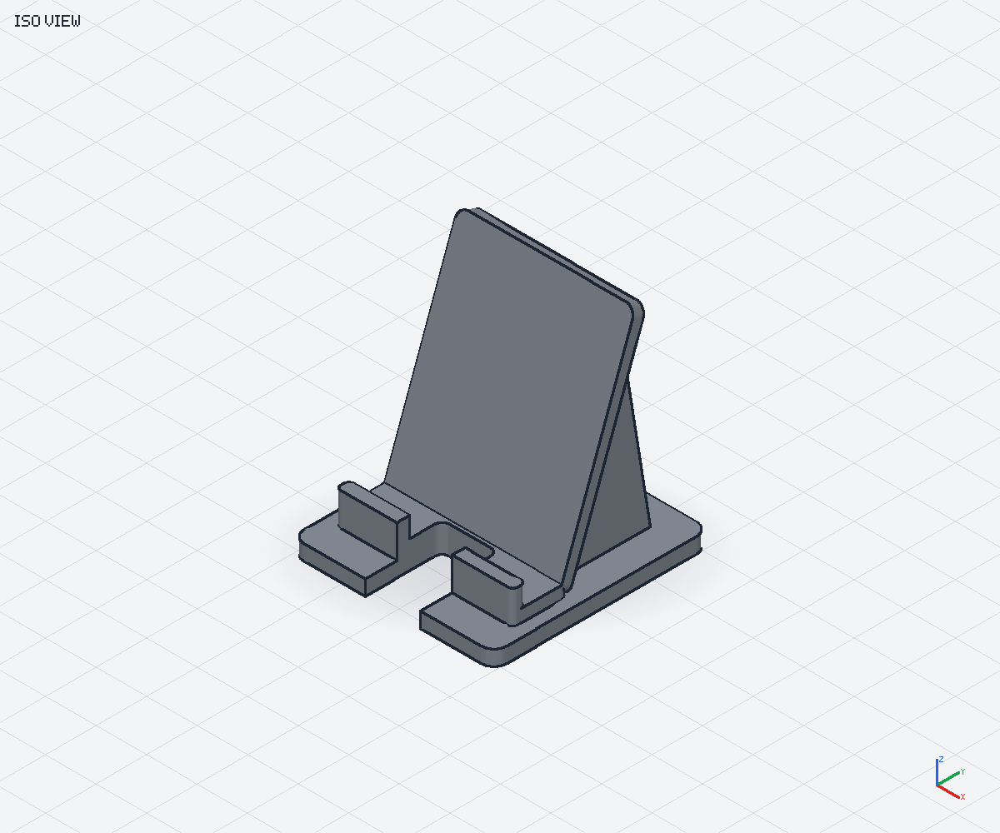
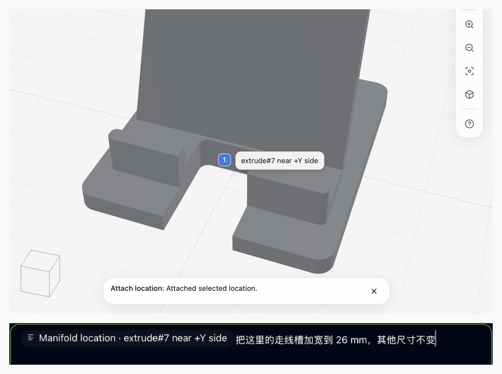

# Manifold 3D 使用指南

[English](usage.md) | [简体中文](usage.zh-CN.md) · [返回 README](../README.zh-CN.md)

向助手描述模型，校验生成的 TypeScript，检查结果，再导出 STL。两种插件共享
建模引擎，但预览与反馈方式不同。

## 安装

### 环境要求与宿主选择

- **Node.js 24 或更高版本**，运行插件的宿主必须能找到它。
- **原生 Canvas：** 支持 Canvas 的 Copilot CLI / Copilot app。
- **MCP/浏览器：** Copilot CLI 或 Claude Code。其他 stdio MCP 客户端可使用
  下文的独立发布文件。

插件包含运行时、Worker、WASM、Viewer 资源，以及适配宿主的建模技能。
安装插件时不运行 npm，也不下载依赖。Canvas 由宿主提供；安装 MCP 服务器
不会为宿主添加 Canvas 能力。

### Copilot：原生 Canvas

```sh
copilot plugin marketplace add zhicwan/manifold3d-mcp
copilot plugin install manifold-extension@manifold3d-mcp
```

请助手使用 Manifold，并打开 **Manifold 3D Viewer** Canvas。该插件注册
`manifold_validate_script`、`manifold_execute_script`、`manifold_capture_view`
三个工具，并提供 `use-manifold-canvas` 技能；不会启动 MCP 服务器。

### Copilot CLI：MCP 与浏览器 Viewer

```sh
copilot plugin marketplace add zhicwan/manifold3d-mcp
copilot plugin install manifold@manifold3d-mcp
```

### Claude Code：MCP 与浏览器 Viewer

在 Claude Code 内执行：

```text
/plugin marketplace add zhicwan/manifold3d-mcp
/plugin install manifold@manifold3d-mcp
```

MCP 插件提供 `use-manifold` 技能，以及 `validate_script`、`execute_script`、
`get_annotations`、`capture_view` 工具。执行成功后返回浏览器 Viewer 的
`previewUrl`。可选的 XR 功能属于浏览器体验，不属于原生 Canvas。

### 独立 MCP

从 [GitHub Releases](https://github.com/zhicwan/manifold3d-mcp/releases) 下载
`manifold.mjs`，将 stdio MCP 客户端配置为启动：

```sh
node /absolute/path/to/manifold.mjs
```

在客户端 MCP 配置中，将命令设为 `node`，参数设为发布文件的绝对路径。
无需同目录资源文件或 `node_modules`。独立进程继承启动时的工作目录。
另一个发布文件 `extension.mjs` 需要 Copilot 扩展宿主，不能作为独立应用运行。

### 更新与迁移

新版本通过本仓库分发，不通过 npmjs.org。请使用宿主提供的插件更新命令。
旧 npm 版本保持不变。

替换旧安装方式前：

1. 如果改用 `manifold` 插件，移除之前手动配置的 `npx` MCP 服务器。
2. 如果改用 `manifold-extension`，移除之前安装到用户目录的扩展副本，
   避免同一组工具被重复注册。
3. 启动新的宿主会话，确认目标插件的工具可用。

两种插件具有不同的技能名称，可以独立安装，无需同时安装。如果两者都已安装，
请告诉助手本次要使用哪种工作流。

## 第一个模型

试试这条提示词：

```text
使用 Manifold 设计一个参数化手机支架，单位为毫米：宽 80 mm、深 85 mm，
底板厚 6 mm，靠背相对竖直方向倾斜 20 度，前部中央留一个 14 mm 宽的
走线槽。将关键尺寸写成命名参数。校验脚本、预览模型，并检查渲染视图后
再向我展示结果。
```

推荐流程是 **描述 → 校验 → 执行 → 检查 → 修改**：

1. 提供尺寸、配合要求和用途。
2. 让助手校验脚本，并对照你的要求检查报告中的尺寸。仅校验不会更新预览。
3. 执行已通过校验的脚本。Canvas 需要打开面板；MCP 如果没有自动打开浏览器，
   可打开返回的 `previewUrl`。
4. 从合适的角度检查模型，包括渲染截图。提出具体修改，例如
   “把走线槽加宽到 22 mm，其他部分保持不变。”
5. 修改后重复校验与检查，确认后再导出。

代码由助手编写，你也可以保存并编辑。脚本约定使用毫米，使用预先提供的
`Manifold`、`CrossSection`、`Mesh` 全局对象，并将最终实体赋值给 `result`，
不要重新声明 `result`，也不要添加 import 或 export。一个最小示例：

```ts
const size: [number, number, number] = [20, 20, 10];
result = Manifold.cube(size);
```

完整设计见[示例](../samples/README.zh-CN.md)，沙箱规则见英文
[脚本参考](../skills/shared/references/script-conventions.md)。

## 示例：加宽走线槽

| 修改前：14 mm 走线槽                                                                | 修改后：22 mm 走线槽                                                                             |
| ----------------------------------------------------------------------------------- | ------------------------------------------------------------------------------------------------ |
|  |  |

_软件渲染的模型对比图；Canvas 交互截图见下文。_

两种版本的外形尺寸都约为 **80 × 85 × 91.6 mm**，底板厚 6 mm，靠背相对
竖直方向倾斜 20°。加宽走线槽只切除前部更多材料，不改变外形尺寸、靠背或侧面支撑。

复现对比的方法：

1. 打开[手机支架源码](../samples/05-phone-stand.ts)，让助手读取内容，以内联 `code`
   传给所用插件的校验工具，通过后再执行。
2. 检查预览，并用 `iso` 视角渲染截图。
3. 将 `cableSlotWidth` 从 `14` 改为 `22`，再次校验、执行并渲染。
4. 对比前部开口，确认模型其余部分保持不变。

如果想通过交互提出此类修改，可使用下文的 Canvas 或 MCP 反馈流程。

## 使用本地文件

**两种插件都优先使用内联 `code`。** 让助手通过工作区工具读取本地脚本，
再将文件内容作为 `code` 传入。助手读取文件时仍须遵守宿主的权限限制。

| 工作流      | 接受的脚本来源                                              |
| ----------- | ----------------------------------------------------------- |
| 原生 Canvas | 仅内联 `code`，不支持 `filePath`                            |
| MCP         | 内联 `code` 或授权目录内受支持脚本的绝对 `filePath`，二选一 |

对于已安装的 MCP 插件，不要假设服务器在你的项目目录中启动。Copilot 使用
插件目录；Claude 可能保留项目目录。助手能看到文件，**不代表** MCP 服务器
已获得读取权限。

如需使用 `filePath`，请在 **MCP 服务器的环境变量中设置
`MANIFOLD_MCP_SCRIPT_ROOTS`**，明确列出要授权的目录。使用绝对目录路径；
多个目录在 macOS/Linux 上用 `:` 分隔，在 Windows 上用 `;` 分隔。
例如，macOS/Linux 上独立启动：

```sh
MANIFOLD_MCP_SCRIPT_ROOTS="/absolute/path/to/my-models" \
  node /absolute/path/to/manifold.mjs
```

对于已安装的插件，通过宿主的服务器环境配置或启动环境设置该变量，修改后重启
MCP 服务器。授权目录会在进程存续期间缓存。只授权实际需要的目录，不要开放
整个用户主目录或文件系统。

未显式设置时，默认授权服务器工作目录及其 `samples/` 子目录，而不是推测出的
项目根目录。显式设置后，工作目录这一默认项会被替换，但
`<服务器工作目录>/samples` 仍会加入。目录必须存在；路径会先解析符号链接再
检查权限。服务器不会自动扩大访问范围。

授权目录后，让助手先校验绝对文件路径，再执行。如果出现 `FILE_NOT_ALLOWED`，
应改用内联代码或修正服务器的显式授权目录，而不是尝试相对路径。

## 指出你要修改的位置

### 原生 Canvas 反馈

- **Select to chat：** 选中一个点或区域，将位置附加到输入框，不发送消息，
  然后 Viewer 返回浏览模式。补充修改要求，准备好后再发送。
- **Annotate：** 在模型位置添加文字说明。**Attach** 将已保存的标注批次
  放入输入框而不发送；**Fix** 直接将该批次作为修改请求发送。
- 附件是快照。之后编辑标注不会改变已经附加的快照。Fix 发送成功表示请求
  已被接受，不表示助手已经完成模型修改。

#### Select to chat 示例



_同一张 Canvas 截图的两处裁剪：选中位置与尚未发送的修改请求。_

当前模型的走线槽宽 **22 mm**。选中的走线槽位置已附加到输入框，旁边是
**尚未发送的“加宽至 26 mm”修改请求**。这里展示的是修改请求草稿，不是已执行的模型变更。

### MCP 浏览器反馈

使用 **Annotate** 标记一个点或区域并保存说明，然后请助手通过
`get_annotations` 读取标注并进行修改。这与 Canvas 的选中带入对话及
Fix/Attach 工作流不同。

### Viewer 操作

焦点位于 Viewer 时：

| 按键或手势        | 操作                   |
| ----------------- | ---------------------- |
| **V**             | 浏览                   |
| **M**             | 标注                   |
| **S**             | 选择位置（宿主支持时） |
| **F**             | 将模型完整放入视野     |
| 按住 **Space**    | 标记时临时旋转视角     |
| 鼠标中键/右键拖动 | 平移                   |
| 鼠标滚轮          | 缩放                   |
| **?**             | 查看其他手势与快捷键   |

带编号的锚点可按需展开说明。编辑标注时，勾选按钮或 **Enter** 保存，
叉号按钮或 **Escape** 取消当前编辑，**Shift+Enter** 换行。
在标注中输入文字不会切换 Viewer 工具。

## 导出与打印

在 Viewer 中选择 **Export → Export STL**。将 STL 导入切片软件后，以毫米核对
尺寸，并检查打印朝向、支撑、壁厚、间隙与材料。多零件设计应先检查并分别排布
零件，再打印。

**支持的模型导出格式是 STL**，不支持 STEP 或 3MF。如需以后修改参数，请保留
TypeScript 源码；STL 是网格结果，不是参数化项目文件。

校验针对脚本与几何模型，不认证承载能力、制造质量、食品接触安全、动物安全，
也不保证适用于特定用途。报告通过、预览美观，都不能替代对实际打印件的检查与测试。

## 排查问题与延伸阅读

- **没有 Canvas？** 确认 Copilot 宿主支持 Canvas，并且安装的是
  `manifold-extension`，而不只是 `manifold`。
- **工具缺失或重复？** 检查所选插件、Node 版本，以及旧的手动安装配置。
  配置变更后重启宿主。
- **校验失败？** 请助手修复报告中的错误，重新校验后再执行。详见英文
  [校验报告参考](../skills/shared/references/validation-report.md)。
- **需要 SDK 集成或本地开发？** 技术细节以英文
  [Extension README](../apps/copilot-extension/README.md) 和
  [CONTRIBUTING.md](../CONTRIBUTING.md) 为准。
